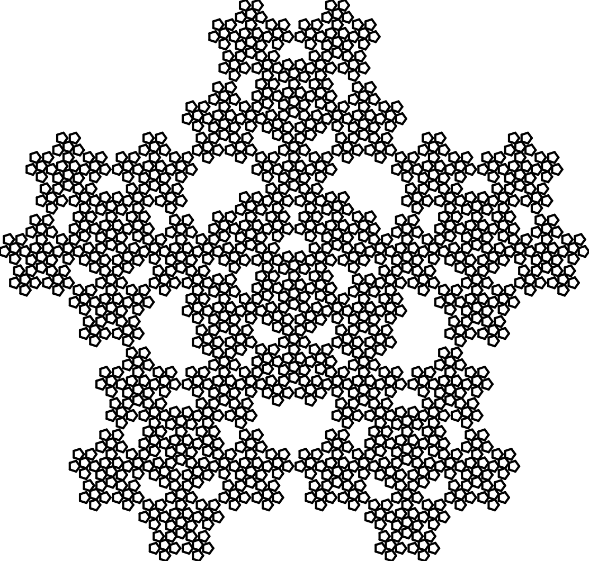

# <p align = "center"> LSystem </p>

 ---

<p align = "center"> Simple c++ L-System generator </p>

-   [What are L-Systems?](#description)
    * [Definition](#definition)
    * [Development](#development)
-   [Documentation](#documentation)
    * [Grammars](#lsystem-grammars)
    * [LSystem](#lsystem)
    * [Program example](#program-example)
-   [Examples](#examples)
    * [Plant](#plant)
    * [Heighway dragon](#heighway-dragon)
    * [Pleasant error](#pleasant-error)
    * [Plant2](#plant2)
    * [Penrose Tiling](#penrose-tiling)

---
## What are L-Systems?
### Definition
An L-system or Lindenmayer system is a parallel rewriting system and a type of formal grammar.

L-systems are now commonly known as parametric L systems, defined as a tuple:

>  G = (V, ω, P),

where
- V (the alphabet) is a set of symbols containing both elements that can be replaced (variables) and those which cannot be replaced ("constants" or "terminals")
- ω (start, axiom or initiator) is a string of symbols from V defining the initial state of the system
- P is a set of production rules or productions defining the way variables can be replaced with combinations of constants and other variables. A production consists of two strings, the predecessor and the successor. For any symbol A which is a member of the set V which does not appear on the left hand side of a production in P, the identity production A → A is assumed; these symbols are called constants or terminals.

### Development
Once the L-system is defined, it begins to evolve according to its rules. The initial state of the L-system is its axiom. With further development, this line describing the state will change. The development of L-systems is cyclic. In each development cycle, a line is viewed from beginning to end, character by character. For each symbol, the rule for which the symbol serves as a precursor is searched. If no such rule is found, the symbol is left unchanged. In other words, for those x characters for which there is no explicit rule, the implicit rule applies: X→X. If the corresponding rule is found, the predecessor character is replaced by the following string from this rule.

## Documentation

## LSystem Grammars

If you want to use only grammars, then use the following classes

```c++
#include "src/StandartGrammar.cpp"
#include "src/StochasticGrammar.cpp"

StandartLSystem lsystem(options);
StochasticLSystem lsys(options);
```

`options` may contain:
- `axiom` A String to set the initial axiom
- `rules` A Vector of the strings with variables and rules

#### Setting axiom
You can simply set your axiom when you init your L-System.
```c++
StandartLSystem lsystem("F-F-F");
```

You can also set an axiom after initialization:
```c++
lsystem.setAxiom("F");
```

#### Setting rules
You can simply set your rules when you init your L-System:

###### DOL
```c++
vector<string> rules = {"A => A-B--B+A++AA+B-"};
StandartLSystem lsystem(rules);
```

Rule string should look like this
```
A => A-B--B+A++AA+B-
```
The first character is the variable name. Then '=>' with spaces. After that, there is a variable replacement rule.

###### Stochastic

```c++
vector<string> rules = {"F => F[+F]F[-F][F] (0.7)", "F => F[+F]F (0.3)"};
StochasticLSystem lsystem(rules);
```
Rule string should look like this
```
F => F[+F]F[-F][F] (0.7)
```
The first character is the variable name. Then '=>' with spaces. After that, there is a variable replacement rule. In brackets you must specify the probability of the rule


Also you could start with an empty L-System object, addRule() to edit the L-System later:
```c++
lsystem.addRule("B","+A-BB--B-A++A+B");
```

### Getting results
Now that we have set up our L-System set, we  can develop our L-System with iterate():

- Iterate once
```c++
lsystem.iterate();
```

- Iterate n-times
```c++
int n = 5;
lsystem.iterate(n);
```

You can get result with getCondition():
```c++
lsystem.addRule("B","+A-B-B-A+");
lsystem.iterate();
lsystem.getCondition();
// 'A+A-B-B-A+A'
```

## LSystem

If you want to use graphical interpretation, use the class

```c++
#include "src/LSystem.cpp"

LSystem ls;
```

### Settings

```c++
ls.setStep(15.0); // set step
ls.setAngle(36.0); // set angle
```

If you want the symbol not to be used by the interpreter, make it a constant:
```c++
ls.addConstant("C");
```

### Produce and interpret LSystem
```c++
ls.build(options);
ls.loop();
```

where `options` may contain:
- `axiom` A String to set the initial axiom
- `rules` A Vector of the strings with variables and rules
- `iterations` A Int parameter for the number of iterations


### Program example
```c++
#include "src/LSystem.cpp"

using namespace std;

vector<string> rules = {
  "6 => 81++91----71[-81----61]++",
  "7 => +81--91[---61--71]+",
  "8 => -61++71[+++81++91]-",
  "9 => --81++++61[+91++++71]--71",
  "1 => "
};

int main( int argc, char *argv[]) {
  	LSystem ls;

    ls.addConstant('6');
    ls.addConstant('7');
    ls.addConstant('8');
    ls.addConstant('9');

    ls.setStep(15.0);
    ls.setAngle(36.0);

    ls.build("[7]++[7]++[7]++[7]++[7]", rules, 5);
    ls.loop();
  return 0;
}

}
```
#### Output


## Examples
### Plant


Iterations - 7<br>
Angle - 25 degrees

|     Axiom     |     Rules     |
| ------------- | ------------- |
| X  | X => F-[[X]+X]+F[+FX]-X<br> F => FF |

### Heighway dragon


Iterations - 13<br>
Angle - 90 degrees

|     Axiom     |     Rules     |
| ------------- | ------------- |
| FX  | X => X+YF+<br> Y => -FX-Y |

### Pleasant Error



Iterations - 4<br>
Angle - 72 degrees

|     Axiom     |     Rules     |
| ------------- | ------------- |
| F-F-F-F-F  | F => F-F++F+F-F-F |

### Plant2
Run plant2_example.cpp to get this example
